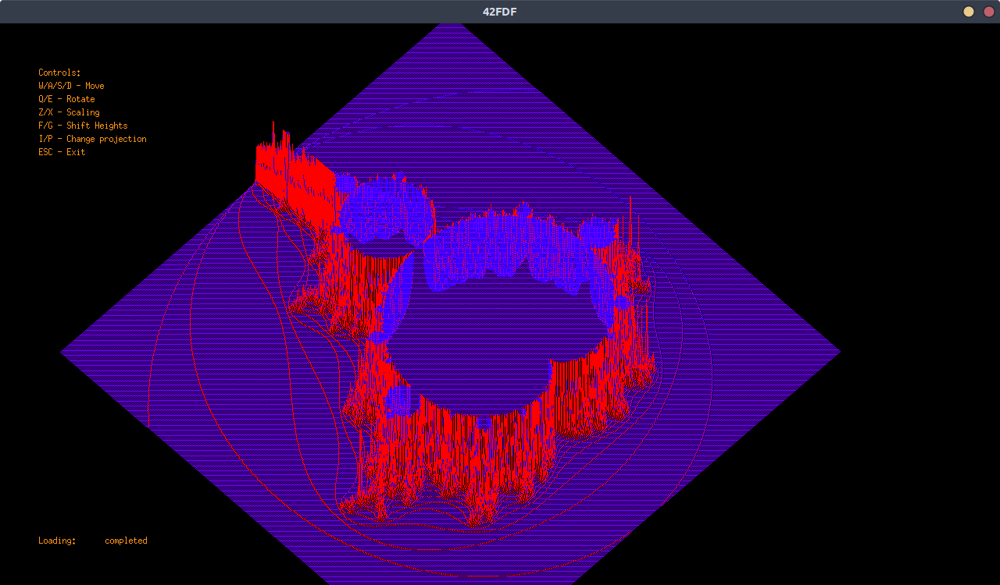

## FDF
___

### About

This project is about creating a simplified graphic “wireframe” representation of a relief landscape linking various points
(x, y, z) via segments. The coordinates of this landscape are stored in a file passed as
a parameter.

FDF project covers the basics of graphic programming, and in particular how
to place points in space, how to join them with segments and most importantly how to
observe the scene from a particular viewpoint.

Allowed external libraries: miniLibX.
This library was developed
internally and includes the minimum necessary to open a window, light a pixel and deal
with events linked to this window: keyboard and mouse.

All functions are created in accordance with [Norm](https://github.com/42School/norminette) - the bunch of rules how code should be formatted.

### Map rules

```
0  0  0  0  0  0  0  0  0  0  0  0  0  0  0  0  0  0  0
0  0  0  0  0  0  0  0  0  0  0  0  0  0  0  0  0  0  0
0  0 10 10  0  0 10 10  0  0  0 10 10 10 10 10  0  0  0
0  0 10 10  0  0 10 10  0  0  0  0  0  0  0 10 10  0  0
0  0 10 10  0  0 10 10  0  0  0  0  0  0  0 10 10  0  0
0  0 10 10 10 10 10 10  0  0  0  0 10 10 10 10  0  0  0
0  0  0 10 10 10 10 10  0  0  0 10 10  0  0  0  0  0  0
0  0  0  0  0  0 10 10  0  0  0 10 10  0  0  0  0  0  0
0  0  0  0  0  0 10 10  0  0  0 10 10 10 10 10 10  0  0
0  0  0  0  0  0  0  0  0  0  0  0  0  0  0  0  0  0  0
0  0  0  0  0  0  0  0  0  0  0  0  0  0  0  0  0  0  0
```

Each number corresponds to a point in space:
* The horizontal position corresponds to its axis.
* The vertical position corresponds to its ordinate.
* The value corresponds to its altitude.

FDF program shows the map in isometric projection.

### Requirements & usage
Project requires:
* C Lang compiler: **gcc** or **clang**
* Possibility to work with Makefile

Tested on:
* MacOS 10.15
* Linux Ubuntu 20.04

Run:
```
$> make all
$> ./fdf maps/42.fdf 
```



### Controls

* W/A/S/D - Move
* Q/E - Rotate
* Z/X - Scaling
* F/G - Shift Heights
* I/P - Change projection
* ESC - Exit